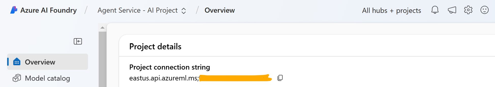

# Multiagent Research

An exploration using a team of AI agents working together to research and write a news article. Each agent has a specific role, like researching, writing, or fact-checking, to create a well-rounded and accurate article


## Setup
You will first need to create an [Azure OpenAI resource](https://portal.azure.com/#create/Microsoft.CognitiveServicesOpenAI) with a GPT-4o model deployment, and update the .env file with the project connection string (and the deployment name if you change from the default).

You can copy the connection string from your AI Foundry Project settings, as shown in the image below:


To use the Bing Search API, you will also need to create a [Grounding with Bing Search resource](https://learn.microsoft.com/en-us/azure/ai-services/agents/how-to/tools/bing-grounding) and update the .env file with its name.  

Finally, use the following commands in a python environment to set up your environment. This creates and activates an environment and installs the required packages. For subsequent runs after the initial install, you will only need to activate the environment and then run the python script.

If you are using the newest version of Foundry (as of 06/2025) you can connect to the project like this:

```python
project_client = AIProjectClient(
    endpoint=os.getenv("PROJECT_ENDPOINT"),  # Replace with your Azure AI project endpoint
    subscription_id=os.getenv("AZURE_SUBSCRIPTION_ID"),  # Replace with your Azure subscription IDres
    resource_group_name=os.getenv("AZURE_RESOURCE_GROUP_NAME"),  # Replace with your Azure resource group nameproject_name=os.getenv("AZURE_PROJECT_NAME")  # Replace with your Azure project name
    project_name=os.getenv("AZURE_PROJECT_NAME"),  # Replace with your Azure project name
    credential=DefaultAzureCredential()
)
```

### First run
```
conda create --name research -y
conda activate research

pip install -r requirements.txt
python journalism_research_bing_grounding.py
```

### Subsequent runs
```
conda activate research
python journalism_research_bing_grounding.py
```
## Demo video on YouTube
[](https://www.youtube.com/watch?v=DORItnrxpJk)

*Click the image above to play on YouTube.